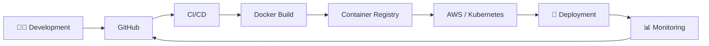

# 👋 Hi, I'm Priyanshu Panwar

### ☁️ AWS Cloud & DevOps Engineer | Kubernetes | Terraform | CI/CD

<p align="center">
  
</p>

<p align="center">
  <a href="https://priyanshu-cloud-engineer.vercel.app/">
    
  </a>
  <a href="https://www.linkedin.com/in/priyanshu-panwar-cloud-devops">
    
  </a>
  <a href="mailto:priyanshu.panwar841@gmail.com">
    
  </a>
</p>

---

## 🚀 About Me

I'm an **AWS Certified Cloud Practitioner** and **DevOps Engineer Intern** with hands-on experience in **AWS, Docker, Kubernetes, Terraform, Linux, and CI/CD automation**.

I enjoy building and deploying cloud-native applications, automating infrastructure, containerizing applications, and creating reliable deployment workflows.

My experience includes working with **AWS infrastructure, Dockerized MERN applications, GitHub Actions, Jenkins, SonarQube, Terraform, Kubernetes, Nginx, and Linux-based environments**.

I also have a strong foundation in **Full-Stack Development**, which helps me understand applications from development through deployment and operations.

```text
Code → Build → Containerize → Automate → Deploy → Monitor → Improve
```

🎯 **Current Focus:** AWS Cloud • Kubernetes • Terraform • CI/CD • Linux • Cloud Infrastructure

---

# ☁️ Cloud & DevOps

<p align="center">
  
</p>

### AWS

`EC2` `S3` `RDS` `ECS` `Lambda` `DynamoDB` `IAM` `VPC`

`CloudWatch` `CloudFormation` `Route 53` `Auto Scaling` `ELB`

### Containers & Orchestration

`Docker` • `Docker Compose` • `Kubernetes` • `Nginx`

### Infrastructure as Code

`Terraform` • Modular Configurations • Automated Provisioning • Multi-Environment Setup

### CI/CD & Automation

`GitHub Actions` • `Jenkins` • `Git` • `GitHub` • `SonarQube` • `Bash` • `Python`

### Operating Systems

`Linux` • `Ubuntu` • `CentOS`

---

# 💻 Development & Databases

### Full-Stack Development

<p>
  
</p>

`React.js` • `Next.js` • `Node.js` • `Express.js` • `REST APIs`

### Databases

<p>
  
</p>

`MongoDB Atlas` • `MySQL` • `PostgreSQL`

### Networking

`TCP/IP` • `DNS` • `HTTP/HTTPS` • `SSH` • `VPN` • `Load Balancing`

`Firewalls` • `Routing` • `Subnetting` • `Cisco Packet Tracer`

---

# 💼 Professional Experience

### 🔧 DevOps Engineer Intern — Wyreflow Technologies

**Remote · Jun 2026 – Sep 2026**

* ⚙️ Implemented CI/CD workflows using **GitHub Actions, Git, and Docker**
* 🐳 Containerized and deployed **MERN applications** using Docker and Docker Compose
* 🔍 Performed **SonarQube code-quality analysis and optimization**
* 🛠️ Troubleshot containerized applications and deployment issues
* 🤝 Collaborated with development teams on Git-based workflows
* 🚀 Supported application configuration and DevOps deployment processes

---

# 🚀 Featured Projects

## ☁️ Fluent AI — Cloud Deployment Platform

**AWS EC2 · Docker · Docker Compose · GitHub Actions · Nginx · MongoDB Atlas**

A full-stack AI application deployed using a containerized AWS architecture.

### Highlights

* 🐳 Containerized the application using Docker and Docker Compose
* ☁️ Deployed the application on **AWS EC2**
* 🔀 Configured **Nginx Reverse Proxy**
* 🔄 Automated build, test, and deployment using **GitHub Actions**
* 🗄️ Integrated MongoDB Atlas
* 🚀 Designed a practical cloud deployment workflow

---

## ⚙️ Enterprise DevOps CI/CD Automation Pipeline

**Docker · Jenkins · Kubernetes · AWS · GitHub Actions**

An end-to-end DevOps pipeline focused on automated application delivery.

### Highlights

* 🔄 Built CI/CD pipelines using **Jenkins and GitHub Actions**
* 🐳 Automated Docker image builds
* ☸️ Deployed containerized applications to Kubernetes
* 🧪 Automated testing and validation workflows
* 🚀 Implemented rolling deployment strategies
* 🔙 Added monitoring and rollback workflows to improve deployment reliability

---

## 🏗️ Multi-Cloud Infrastructure Automation Platform

**Terraform · AWS · Docker · Kubernetes · Linux**

Infrastructure automation project focused on reproducible cloud environments.

### Highlights

* 🏗️ Created reusable **Terraform configurations**
* ☁️ Automated AWS infrastructure provisioning
* 🔧 Built modular infrastructure configurations
* ☸️ Created Kubernetes deployment manifests
* 🐧 Developed Linux automation scripts
* ♻️ Standardized infrastructure and deployment environments

---

## 📊 Telecom Customer Churn Prediction Platform

**AWS EC2 · S3 · IAM · CloudWatch · Docker · GitHub Actions · Python · Scikit-learn · SQL · React.js**

A machine-learning platform deployed on AWS for analyzing telecom customer churn.

### Highlights

* 📈 Analyzed **243,000+ telecom records**
* 🤖 Built churn prediction models using **Python and Scikit-learn**
* 🐳 Dockerized the ML application
* ☁️ Deployed the platform on **AWS EC2**
* 🗄️ Used **Amazon S3** for storage
* 🔐 Used **IAM** for access management
* 📊 Used **CloudWatch** for monitoring
* 🔄 Integrated **GitHub Actions** for CI/CD

---

# 🔄 DevOps Workflow



---

# 🧠 Engineering Interests

* ☁️ Cloud Infrastructure
* ⚙️ DevOps Engineering
* 🐳 Containerization
* ☸️ Kubernetes
* 🏗️ Infrastructure as Code
* 🔄 CI/CD Automation
* 🔐 Cloud Security
* 📊 Monitoring & Observability
* 🌐 Networking
* 🚀 Cloud-Native Architecture
* 🛠️ Site Reliability & Platform Engineering

---

# 📚 Certifications

| Certification                                         | Provider             |
| ----------------------------------------------------- | -------------------- |
| ☁️ AWS Certified Cloud Practitioner                   | AWS                  |
| ☸️ Certified Kubernetes Application Developer (CKAD)  | Pearson / Coursera   |
| 🏗️ Terraform on AWS: From Basics to Guru             | Pearson / Coursera   |
| 🐳 Docker for Beginners with Hands-on Labs            | KodeKloud / Coursera |
| 🔐 Connect and Protect: Networks and Network Security | Google / Coursera    |
| 🗄️ SQL for Data Science                              | UC Davis / Coursera  |

---

# 🎯 Current Focus

```text
☁️ AWS Cloud Architecture
        ↓
🐳 Docker & Containerization
        ↓
☸️ Kubernetes
        ↓
🏗️ Terraform & Infrastructure as Code
        ↓
🔄 CI/CD Automation
        ↓
📊 Monitoring & Observability
        ↓
🔐 Cloud Security
```

---

# 📊 GitHub Analytics

<p align="center">
  
  
</p>

<p align="center">
  
</p>

---

# 🎓 Education

### Master of Computer Applications — Data Science

**Bennett University, Greater Noida**
`2025 – 2027 · Pursuing`

### Bachelor of Computer Applications

**Maa Shakumbhari University, Saharanpur**
`2022 – 2025`

---

# 💼 Open to Opportunities

I'm interested in entry-level opportunities as a:

**☁️ Cloud Engineer · ⚙️ DevOps Engineer · 🏗️ Platform Engineer · 🖥️ System Engineer · 🚀 SRE**

I'm particularly interested in roles involving:

`AWS` • `Docker` • `Kubernetes` • `Terraform` • `CI/CD` • `Linux`

---

# 🤝 Let's Connect

<p align="center">

<a href="https://priyanshu-cloud-engineer.vercel.app/">

</a>

<a href="https://www.linkedin.com/in/priyanshu-panwar-cloud-devops">

</a>

<a href="mailto:priyanshu.panwar841@gmail.com">

</a>

</p>

<p align="center">
  <i>☁️ Build. Automate. Deploy. Scale. 🚀</i>
</p>

<p align="center">
  
</p>
