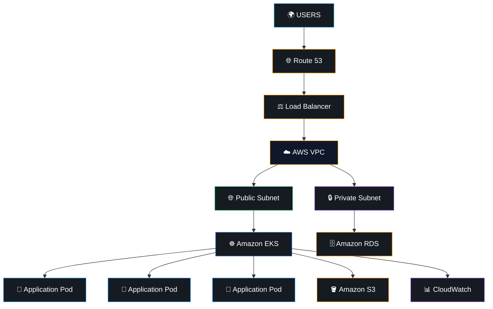
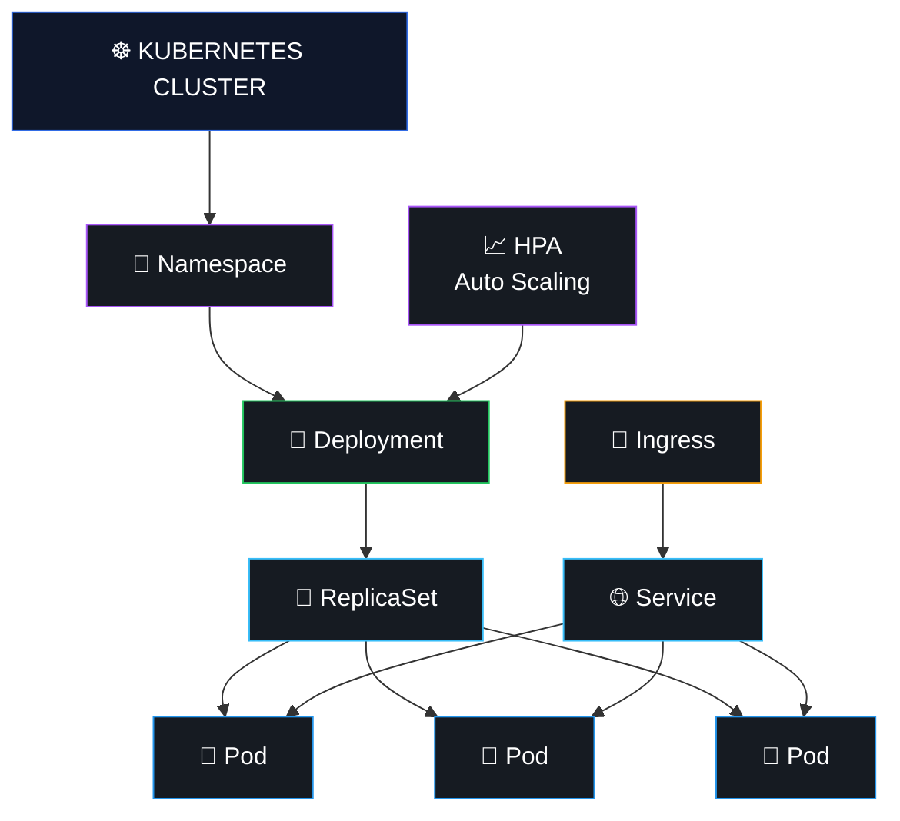
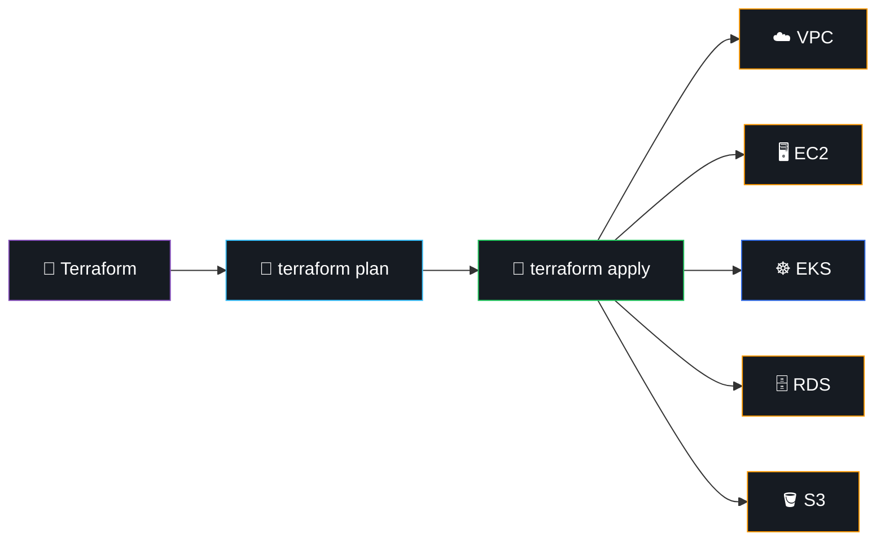
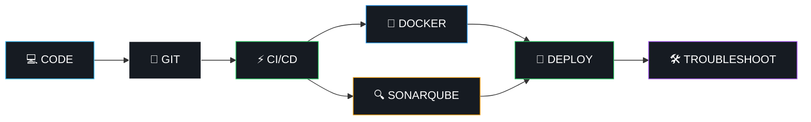
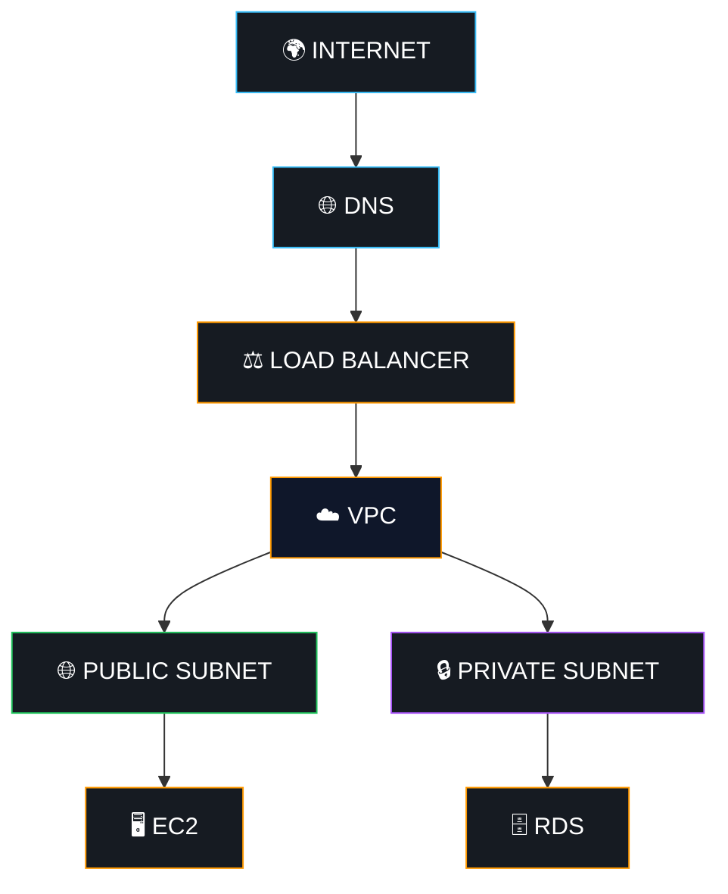

<div align="center">


<br>


<br><br>

<a href="https://priyanshu-cloud-engineer.vercel.app/">

</a>

<a href="https://www.linkedin.com/in/priyanshu-panwar-cloud-devops">

</a>

<a href="mailto:priyanshu.panwar841@gmail.com">

</a>

<br><br>


</div>

---

# 🖥️ `terminal@priyanshu:~$ ./about-me`

```bash
┌──(priyanshu㉿cloud-devops)-[~/profile]
└─$ cat about.txt

Name         : Priyanshu Panwar
Role         : Cloud & DevOps Engineer
Speciality   : Cloud Infrastructure & Automation
Cloud        : AWS
Containers   : Docker
Orchestration: Kubernetes / Amazon EKS
IaC          : Terraform
CI/CD        : GitHub Actions / Jenkins
OS           : Linux

Certification:
  AWS Certified Cloud Practitioner

Mission:
  Build it.
  Automate it.
  Deploy it.
  Monitor it.
  Make it better.
```

---

# ☁️ `01 / CLOUD & DEVOPS`

<div align="center">


<br><br>


</div>

<br>

| ☁️ Cloud |     🐳 Containers    | ☸️ Platform |  ⚙️ Automation |
| :------: | :------------------: | :---------: | :------------: |
|    AWS   |        Docker        |  Kubernetes | GitHub Actions |
|    EC2   |    Docker Compose    |  Amazon EKS |     Jenkins    |
|    S3    |   Containerization   | Deployments |       Git      |
|    RDS   |   Image Management   |   Services  |      Bash      |
|    ECS   | Multi-container Apps |   Scaling   |     Python     |
|  Lambda  |           —          |    Nginx    |        —       |

---

# 🏗️ `02 / CLOUD ARCHITECTURE`

<div align="center">

### `FROM INTERNET → AWS → KUBERNETES → APPLICATION`

</div>



<div align="center">

`AWS` → `VPC` → `EKS` → `CONTAINERS` → `APPLICATION`

</div>

---

# ⚙️ `03 / DEVOPS PIPELINE`

<div align="center">

### `COMMIT → BUILD → TEST → SCAN → CONTAINERIZE → DEPLOY → MONITOR`

```mermaid
flowchart LR

    DEV["👨‍💻 Developer"]
    GIT["🐙 GitHub"]
    CI["⚡ GitHub Actions"]
    QUALITY["🔍 SonarQube"]
    BUILD["🔨 Build"]
    DOCKER["🐳 Docker"]
    REGISTRY["📦 Registry"]
    K8S["☸️ Kubernetes"]
    EKS["☁️ Amazon EKS"]
    APP["🚀 Application"]
    MONITOR["📊 Monitor"]

    DEV --> GIT
    GIT --> CI
    CI --> QUALITY
    QUALITY --> BUILD
    BUILD --> DOCKER
    DOCKER --> REGISTRY
    REGISTRY --> K8S
    K8S --> EKS
    EKS --> APP
    APP --> MONITOR

    style DEV fill:#161b22,stroke:#38BDF8,color:#FFFFFF
    style GIT fill:#161b22,stroke:#FFFFFF,color:#FFFFFF
    style CI fill:#161b22,stroke:#22C55E,color:#FFFFFF
    style QUALITY fill:#161b22,stroke:#F59E0B,color:#FFFFFF
    style BUILD fill:#161b22,stroke:#38BDF8,color:#FFFFFF
    style DOCKER fill:#161b22,stroke:#2496ED,color:#FFFFFF
    style REGISTRY fill:#161b22,stroke:#38BDF8,color:#FFFFFF
    style K8S fill:#161b22,stroke:#326CE5,color:#FFFFFF
    style EKS fill:#161b22,stroke:#FF9900,color:#FFFFFF
    style APP fill:#161b22,stroke:#22C55E,color:#FFFFFF
    style MONITOR fill:#161b22,stroke:#A855F7,color:#FFFFFF
```

</div>



---

# 🐳 `04 / CONTAINERIZATION`

<div align="center">

### `BUILD ONCE • RUN ANYWHERE`

</div>


### Docker Toolkit

`Dockerfile` · `Docker Images` · `Containers` · `Docker Compose` · `Multi-container Applications`

---

# ☸️ `05 / KUBERNETES`

<div align="center">

### `CONTAINER ORCHESTRATION`

</div>



<div align="center">

`DEPLOYMENTS` · `SERVICES` · `PODS` · `SCALING` · `INGRESS` · `EKS`

</div>

---

# 🏗️ `06 / INFRASTRUCTURE AS CODE`

<div align="center">

### `TERRAFORM → AWS INFRASTRUCTURE`

</div>



### Infrastructure Philosophy

```text
DEFINE
   ↓
PLAN
   ↓
APPLY
   ↓
PROVISION
   ↓
CONFIGURE
   ↓
DEPLOY
   ↓
MANAGE
```

---

# 🚀 `07 / FEATURED PROJECT`

<div align="center">

# 🏠 EstateHub

### `CLOUD-NATIVE DEVOPS DEPLOYMENT`

```mermaid
flowchart LR

    DEV["👨‍💻 Developer"]
    GIT["🐙 GitHub"]
    DOCKER["🐳 Docker"]
    K8S["☸️ Kubernetes"]
    EKS["☁️ Amazon EKS"]
    APP["🏠 EstateHub"]

    DEV -->|Push| GIT
    GIT -->|Build| DOCKER
    DOCKER -->|Deploy| K8S
    K8S -->|Orchestrate| EKS
    EKS -->|Run| APP

    style DEV fill:#161b22,stroke:#38BDF8,color:#FFFFFF
    style GIT fill:#161b22,stroke:#FFFFFF,color:#FFFFFF
    style DOCKER fill:#161b22,stroke:#2496ED,color:#FFFFFF
    style K8S fill:#161b22,stroke:#326CE5,color:#FFFFFF
    style EKS fill:#161b22,stroke:#FF9900,color:#FFFFFF
    style APP fill:#161b22,stroke:#22C55E,color:#FFFFFF
```

<a href="https://github.com/priyanshupanwar066/estatehub-devops">


</a>

</div>



### 🔧 Project Stack

<div align="center">


</div>

### DevOps Implementation

* 🐳 Containerized application deployment
* ☸️ Kubernetes orchestration
* ☁️ Amazon EKS deployment
* 📦 Docker image management
* 🚀 Cloud-native deployment workflow
* 📈 Scalability and availability concepts
* 🛠️ Infrastructure and deployment troubleshooting

---

# 💼 `08 / PROFESSIONAL EXPERIENCE`

<div align="center">

## 🔧 DevOps Engineer Intern

### Wyreflow Technologies

`JUN 2026 → SEP 2026`

</div>



### Hands-on Areas

* ⚙️ CI/CD workflows
* 🐳 Docker & Docker Compose
* ⚡ GitHub Actions
* 🔍 SonarQube
* 🐙 Git & GitHub workflows
* 🚀 Application deployment
* 🛠️ Environment troubleshooting
* 🤝 Deployment process improvement

---

# 🧰 `09 / TECHNICAL ARSENAL`

<div align="center">


<br><br>


</div>

<br>

| Category              | Technologies                               |
| --------------------- | ------------------------------------------ |
| ☁️ **Cloud**          | AWS, EC2, S3, RDS, ECS, Lambda, DynamoDB   |
| 🔐 **AWS Security**   | IAM, VPC, Security Groups                  |
| 🌐 **AWS Networking** | Route 53, Load Balancing, Subnets, Routing |
| 🐳 **Containers**     | Docker, Docker Compose                     |
| ☸️ **Orchestration**  | Kubernetes, Amazon EKS                     |
| 🏗️ **IaC**           | Terraform, CloudFormation                  |
| 🔄 **CI/CD**          | GitHub Actions, Jenkins                    |
| 🐧 **Systems**        | Linux, Ubuntu, CentOS, Bash                |
| 🔍 **Quality**        | SonarQube, Selenium                        |
| 💻 **Frontend**       | React.js, Next.js, HTML, CSS, JavaScript   |
| ⚙️ **Backend**        | Node.js, Express.js, REST APIs             |
| 🗄️ **Database**      | MongoDB Atlas, MySQL, PostgreSQL           |
| 🔧 **Tools**          | Git, GitHub, VS Code, Postman, Figma       |

---

# 🌐 `10 / NETWORKING`



### Networking Knowledge

`TCP/IP` · `DNS` · `HTTP/HTTPS` · `SSH` · `VPN` · `Routing` · `Subnetting` · `Load Balancing` · `Firewalls`

---

# 📊 `11 / GITHUB SYSTEM STATUS`

<div align="center">

### `LIVE PROFILE METRICS`

<br>


<br><br>


<br><br>

### `ENGINEERING ACTIVITY`
 


<br/><br/>
 
<a href="https://github.com/priyanshupanwar066">

</a>
</div>

---

# 🐍 `12 / CONTRIBUTION MATRIX`

<div align="center">


</div>

---

# 🧠 `13 / ENGINEERING MINDSET`

<div align="center">

```text
                 ┌─────────────────────┐
                 │     PROBLEM         │
                 └──────────┬──────────┘
                            │
                            ▼
                 ┌─────────────────────┐
                 │      AUTOMATE       │
                 └──────────┬──────────┘
                            │
                            ▼
                 ┌─────────────────────┐
                 │       DEPLOY        │
                 └──────────┬──────────┘
                            │
                            ▼
                 ┌─────────────────────┐
                 │       MONITOR       │
                 └──────────┬──────────┘
                            │
                            ▼
                 ┌─────────────────────┐
                 │       IMPROVE       │
                 └─────────────────────┘
```

### **Make it work → Make it automated → Make it reliable.**

<br>

`AUTOMATION`   `RELIABILITY`   `SCALABILITY`   `SECURITY`   `OBSERVABILITY`

</div>

---

# 🎯 `14 / CURRENTLY BUILDING`

<div align="center">

```text
╔══════════════════════════════════════════════╗
║              CURRENT OBJECTIVES              ║
╠══════════════════════════════════════════════╣
║                                              ║
║  ☁️  AWS Cloud Architecture                  ║
║  ☸️  Advanced Kubernetes / EKS              ║
║  🏗️  Terraform Infrastructure               ║
║  🔄  CI/CD Optimization                      ║
║  📊  Monitoring & Observability              ║
║  🔐  Cloud Security                          ║
║  🐧  Linux Administration                    ║
║                                              ║
╚══════════════════════════════════════════════╝
```

</div>

---

# 🏆 `15 / CERTIFICATION`

<div align="center">


</div>

---

# 🎓 `16 / EDUCATION`

<div align="center">

## 🎓 MCA — Data Science

**Bennett University, Greater Noida**

`2025 → 2027`

<br>

⬇️

<br>

## 🎓 BCA

**Maa Shakumbhari University, Saharanpur**

`2022 → 2025`

</div>

---

# 🟢 `17 / OPEN TO OPPORTUNITIES`

<div align="center">


<br><br>


</div>

---

# 🤝 `18 / CONNECT`

<div align="center">

### Interested in Cloud, DevOps, Kubernetes or Infrastructure?

### Let's build something that survives production. 🚀

<br>

<a href="https://priyanshu-cloud-engineer.vercel.app/">

</a>

<a href="https://www.linkedin.com/in/priyanshu-panwar-cloud-devops">

</a>

<a href="mailto:priyanshu.panwar841@gmail.com">

</a>

<br><br>


<br><br>

```text
☁️ CLOUD
   ↓
⚙️ AUTOMATE
   ↓
🐳 CONTAINERIZE
   ↓
☸️ ORCHESTRATE
   ↓
🚀 DEPLOY
   ↓
📊 OBSERVE
   ↓
🔁 IMPROVE
```

<br>

### `BUILD • AUTOMATE • DEPLOY • SCALE`

</div>

<br>


